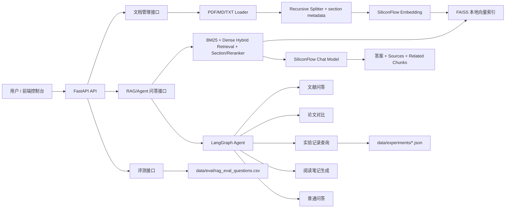

# 科研文献智能问答与实验分析助手


面向论文阅读、实验记录查询和小规模科研知识库管理的 Agentic-style RAG 项目。项目以 FastAPI 提供后端接口，以 LangChain 完成文档解析、切分、向量化和 FAISS 检索，并结合 BM25 混合召回、章节感知重排和可选 SiliconFlow reranker 提升检索质量；同时使用 LangGraph 编排多意图工作流，并提供一个可直接使用的 Web 控制台。

这个项目的定位不是“套壳聊天机器人”，而是一个完整的科研资料工作流样例：从文档上传、知识库构建、检索增强问答、引用溯源、实验记录查询，到评测闭环和工程化交付。


## 项目亮点

- 证据可追溯：回答返回统一引用来源，前端同步展示相关 chunk 和检索调试信息。
- 检索可解释：dense、BM25、RRF hybrid、section rerank、可选 reranker 的关键分数会写入 metadata。
- 评测可迭代：评测集支持 `expected_source`、`expected_keywords` 和 `expected_chunk_ids`，输出 source hit、keyword hit、Recall@K、MRR 和失败样例。
- 交付可复现：提供 Pytest、Ruff、开源审计脚本、Docker build、GitHub Actions、Dependabot 和发布检查清单。
- 演示可直接看：Web 控制台支持文档管理、RAG/Agent/Search 模式、流式 RAG 输出、引用来源和检索链路展示。

## 功能概览

- 文献知识库：支持 PDF、Markdown、TXT 上传；调用重建接口后自动解析、切分、向量化并写入本地 FAISS。
- RAG 问答：通过 dense embedding + BM25 混合召回、section rerank 和可选 SiliconFlow reranker 检索 TopK 片段，再调用 Chat 模型生成回答，并由系统统一追加引用来源。
- 流式输出：`/chat/rag/stream` 使用 SSE 先返回引用和 chunk，再持续推送模型增量文本，适合演示真实 RAG 交互体验。
- Agent 路由：使用 LangGraph 编排文献问答、论文对比、实验记录查询、阅读笔记生成和普通兜底问答；默认规则路由，可通过环境变量启用可选 LLM Router。
- 知识库管理：前端支持查看源文档、浏览 chunk、创建/编辑/删除 Markdown/TXT 文档；Web 控制台在变更后会自动调用重建索引接口，后端 mutation 响应会标记 `index_status=stale`。
- 真实论文 Demo：本地已验证可导入真实 PDF，例如 `Teaching Small Language Models Reasoning through...`。
- 检索调试：前端展示 dense/BM25/hybrid/rerank 分数、section、ranker 和来源通道，便于解释为什么命中某个片段。
- 评测闭环：维护评测问题集，输出来源命中率、关键词命中率、Recall@K、MRR、平均耗时和失败样例。
- 工程交付：提供 Pytest、Ruff、开源审计、评测集一致性检查、Swagger、Docker Compose、GitHub Actions CI 和 Dependabot。

## 技术栈

| 层次 | 技术 |
| --- | --- |
| Web/API | FastAPI, Pydantic, Uvicorn |
| RAG | LangChain, FAISS, BM25, OpenAI-compatible Embeddings, SiliconFlow Rerank |
| Agent | LangGraph |
| LLM Provider | SiliconFlow OpenAI 兼容接口 |
| 前端 | 原生 HTML/CSS/JavaScript |
| 测试 | Pytest, FastAPI TestClient, coverage |
| 工程化 | Ruff, Docker, Docker Compose, GitHub Actions, Dependabot |

## 架构



## 目录结构

```text
科研文献智能问答/
├─ app/
│  ├─ api/              # FastAPI 路由
│  ├─ chains/           # RAG、对比、笔记、普通问答链
│  ├─ graph/            # LangGraph 状态、节点和工作流
│  ├─ retriever/        # 文档加载、切分、向量库、检索重排
│  ├─ services/         # 业务服务封装
│  ├─ static/           # 前端控制台
│  └─ tools/            # Agent 工具
├─ data/
│  ├─ raw_docs/         # 本地知识库源文档
│  ├─ processed_docs/   # chunk 中间产物，默认不提交
│  ├─ experiments/      # 实验记录 JSON
│  └─ eval/             # 评测问题与结果
├─ docs/                # API、架构、Demo、面试说明
├─ scripts/             # 构建索引、评测、Demo 查询
├─ tests/               # 单元测试和 API schema 测试
└─ vector_store/        # FAISS 索引，默认不提交
```

## 3 分钟体验路径

1. 安装依赖并复制 `.env.example` 为 `.env`。
2. 填入 OpenAI-compatible API Key。
3. 运行 `python scripts/build_index.py` 构建样例知识库。
4. 运行 `uvicorn app.main:app --host 0.0.0.0 --port 8010 --reload`。
5. 打开 `http://127.0.0.1:8010/`，选择 RAG 模式并提问：`RAG 为什么要返回引用来源？`
6. 查看右侧引用来源、相关片段和检索调试面板，确认答案证据链。

## 快速启动

### 0. 双击启动（Windows）

如果已经创建好 `.venv` 并安装过依赖，可以直接双击项目根目录下的：

```text
启动项目.bat
```

它会在后台启动 FastAPI 服务，并自动打开：

```text
http://127.0.0.1:8010/
```

如果 8010 端口上已经有服务在运行，脚本会直接打开页面，不会重复启动。需要停止服务时，双击：

```text
停止项目.bat
```

### 1. 本地运行

```powershell
cd 科研文献智能问答
python -m venv .venv
.\.venv\Scripts\Activate.ps1
pip install -r requirements.txt
Copy-Item .env.example .env
```

编辑 `.env`，填入自己的模型服务密钥：

```env
APP_VERSION=0.1.0
OPENAI_COMPATIBLE_API_KEY=your_api_key
OPENAI_COMPATIBLE_BASE_URL=https://api.siliconflow.cn/v1
CHAT_MODEL=deepseek-ai/DeepSeek-V3
EMBEDDING_MODEL=Qwen/Qwen3-Embedding-8B
CORS_ALLOW_ORIGINS=http://127.0.0.1:8010,http://localhost:8010
CORS_ALLOW_CREDENTIALS=false
DEFAULT_TOP_K=4
CHUNK_SIZE=800
CHUNK_OVERLAP=120
MAX_UPLOAD_SIZE_MB=20
RETRIEVAL_MODE=hybrid
ENABLE_RERANKER=false
RERANKER_MODEL=BAAI/bge-reranker-v2-m3
AGENT_ROUTER_MODE=rule
TRUST_LOCAL_FAISS_INDEX=true
```

默认使用本地 BM25 + FAISS dense 混合召回。演示时如需调用硅基流动 rerank API，把 `.env` 中 `ENABLE_RERANKER=true` 即可，默认 reranker 模型为 `BAAI/bge-reranker-v2-m3`。

`TRUST_LOCAL_FAISS_INDEX=true` 表示只加载本项目在本机生成的 FAISS 索引。不要加载陌生来源的 `index.pkl`。

构建知识库并启动服务：

```powershell
python scripts/build_index.py
uvicorn app.main:app --host 0.0.0.0 --port 8010 --reload
```

访问：

- Web 控制台：`http://127.0.0.1:8010/`
- Swagger API 文档：`http://127.0.0.1:8010/docs`
- 健康检查：`http://127.0.0.1:8010/health`，会返回 API Key、索引、源文档和 chunk 基本状态。

退出服务：在启动服务的终端按 `Ctrl + C`。

### 2. Docker Compose 运行

```powershell
cd 科研文献智能问答
Copy-Item .env.example .env
docker compose up --build
```

停止服务：

```powershell
docker compose down
```

Docker Compose 会挂载本地 `data/raw_docs/`、`data/processed_docs/` 和 `vector_store/faiss_index/`，便于保留上传文档和索引。

## 前端功能

Web 控制台默认位于 `http://127.0.0.1:8010/`，包含三块主要区域：

- 左侧运行区：上传文档、重建索引、运行评测、查看服务状态。
- 中间问答区：在 Agent、RAG、Search 三种模式之间切换，可多次提交问题，并展示回答耗时；RAG 模式可开启流式输出。
- 右侧知识库区：查看源文档、编辑 Markdown/TXT、删除文档、查看所有 chunk、当前回答引用来源和检索调试链路。

增删改源文档后，前端会自动调用 `/knowledge/build` 同步索引。直接调用后端 CRUD API 时，接口会返回 `index_status=stale`，调用方需要显式触发 `/knowledge/build`。PDF 在当前版本中只读，Markdown/TXT 可直接编辑。

## API 摘要

| 接口 | 说明 |
| --- | --- |
| `GET /health` | 服务健康检查，包含 API Key、索引和文档状态 |
| `POST /documents/upload` | 上传 PDF/Markdown/TXT |
| `GET /documents` | 查看源文档列表 |
| `POST /documents` | 新建 Markdown/TXT 文档 |
| `GET /documents/{filename}` | 读取文档内容 |
| `PUT /documents/{filename}` | 更新 Markdown/TXT 文档 |
| `DELETE /documents/{filename}` | 删除源文档并返回索引过期状态 |
| `GET /documents/chunks` | 查看已切分 chunk |
| `POST /knowledge/build` | 构建 FAISS 知识库 |
| `POST /knowledge/search` | TopK 检索 |
| `POST /chat/rag` | 普通 RAG 问答 |
| `POST /chat/rag/stream` | SSE 流式 RAG 问答 |
| `POST /chat/agent` | Agentic RAG 问答 |
| `POST /experiments/search` | 查询实验记录 |
| `POST /eval/run` | 运行评测 |

更完整的请求示例见 [docs/API接口文档.md](docs/API接口文档.md)。

## RAG 与 Agent 原理

1. 文档加载：PDF 通过 `pypdf` 提取页级文本，Markdown/TXT 直接读取。
2. 文本切分：使用 `RecursiveCharacterTextSplitter`，按标题、段落、句号、逗号和空格递归切分，默认 `chunk_size=800`、`chunk_overlap=120`。
3. 元数据增强：为 chunk 注入 `source`、`page`、`doc_id`、`chunk_id`、`section` 等字段。
4. 向量化：调用 OpenAI 兼容 Embedding 接口，将 chunk 转成向量。
5. 检索：FAISS dense 检索先召回语义候选，BM25 从 `chunks.jsonl` 做关键词候选召回，两路结果按归一化分数和 RRF 融合。
6. 精排：根据问题意图做 section rerank，例如主要贡献优先 Abstract/Introduction，实验问题优先 Experiments/Results；开启 `ENABLE_RERANKER=true` 后，再调用 SiliconFlow `/rerank` 做二阶段精排。
7. 调试：检索结果 metadata 保留 dense、BM25、hybrid、section adjusted、reranker 等分数，前端可直接展示排序链路。
8. 生成：把检索片段作为上下文输入 Chat 模型，要求答案基于资料，并在返回后由系统补齐统一编号的引用来源；RAG 模式支持 SSE 流式输出。
9. 路由：LangGraph 先识别意图，再进入文献问答、论文对比、实验查询、笔记生成或普通问答节点；默认使用规则路由，设置 `AGENT_ROUTER_MODE=hybrid` 或 `llm` 后可启用模型路由兜底。

## 示例问题

```text
这篇 Teaching Small Language Models Reasoning through... 的主要贡献是什么？
请总结这篇论文的方法流程。
这篇论文做了哪些实验，使用了哪些指标？
对比 LoRA 和知识蒸馏的区别。
查询 EXP-003 的实验结果。
帮我生成 RAG 应用开发笔记的阅读笔记。
```

## 评测

```powershell
python scripts/run_eval.py
python scripts/run_eval.py --limit 5
```

评测集位于 `data/eval/rag_eval_questions.csv`，覆盖当前 `data/raw_docs/` 中的样例笔记、实验记录和普通问答兜底。结果输出到 `data/eval/eval_result.csv`，该文件属于本地运行产物，不建议提交。当前指标：

- `source_hit_rate`：回答或工具结果是否命中预期来源。
- `keyword_hit_rate`：回答是否覆盖预期关键词，默认命中一半以上关键词视为通过。
- `retrieval_recall_at_k`：有 gold chunk 的问题中，TopK 是否召回预期片段。
- `mean_reciprocal_rank`：第一个 gold chunk 排名倒数的平均值。
- `avg_latency`：平均响应耗时。
- `failed_cases`：保留失败样例，便于继续优化检索、Prompt 和切分策略。

详细说明见 [docs/评测报告.md](docs/评测报告.md)。

## 数据与开源说明

- `data/raw_docs/*.md` 是为了演示 RAG 流程编写的样例笔记，不代表真实论文原文。
- 真实论文 PDF 建议只保留在本地，不直接提交到 GitHub，除非确认具有可再分发许可。本项目已默认忽略 `data/raw_docs/*.pdf`。
- `.env`、`.venv/`、FAISS 索引、chunk 中间文件、评测输出和真实 PDF 默认不纳入版本控制，也不应放入对外发布压缩包。
- 上传接口默认限制单文件最大 20MB，空文件会被拒绝，同名文件会自动追加序号避免覆盖。
- 项目使用 MIT License；发布前可运行 `python scripts/open_source_audit.py` 检查敏感文件和常见密钥形态。

发布到 GitHub 前建议先过一遍 [docs/开源发布检查清单.md](docs/开源发布检查清单.md)。

## 测试

```powershell
.\.venv\Scripts\python.exe -m pytest
```

无 API Key 场景下，测试通过 mock 覆盖 health、loader、retrieval、RAG、Agent 路由、API schema 和评测集来源一致性。

## 工程质量检查

本地提交前建议运行：

```powershell
pip install -r requirements-dev.txt
.\scripts\check.ps1
```

CI 会执行：

- `python scripts/open_source_audit.py`：检查敏感文件是否被跟踪，并扫描常见密钥形态。
- `ruff check .`：静态检查和导入排序。
- `python -m pytest --cov=app --cov-report=term-missing`：单测和覆盖率报告。
- `pip-audit -r requirements.txt`：依赖漏洞审计，CI 中作为信息项。
- `docker build .`：验证镜像可构建。

## 简历写法

科研文献智能问答与实验分析助手｜FastAPI、LangChain、LangGraph、FAISS、OpenAI Compatible API

- 设计并实现面向科研文献的 Agentic-style RAG 系统，支持 PDF/Markdown/TXT 文档解析、chunk 切分、Embedding 向量化、FAISS + BM25 混合检索、SiliconFlow rerank 精排和引用来源返回。
- 使用 LangGraph 编排文献问答、论文对比、实验记录查询、阅读笔记生成等多意图工作流，结合规则路由和可选 LLM Router 提供完整交互入口。
- 构建评测集统计 source hit rate、keyword hit rate 和响应耗时，并根据失败样例优化检索重排、Prompt 和 chunk 参数。

## 后续优化方向

- 接入真实论文元数据解析：标题、作者、摘要、DOI、发表年份。
- 增加多轮记忆：支持基于会话的连续追问和引用继承。
- 增加用户级知识库隔离：为多用户或多项目场景准备权限边界。
- 支持 OCR、论文表格/图片解析和跨文档 evidence graph。
