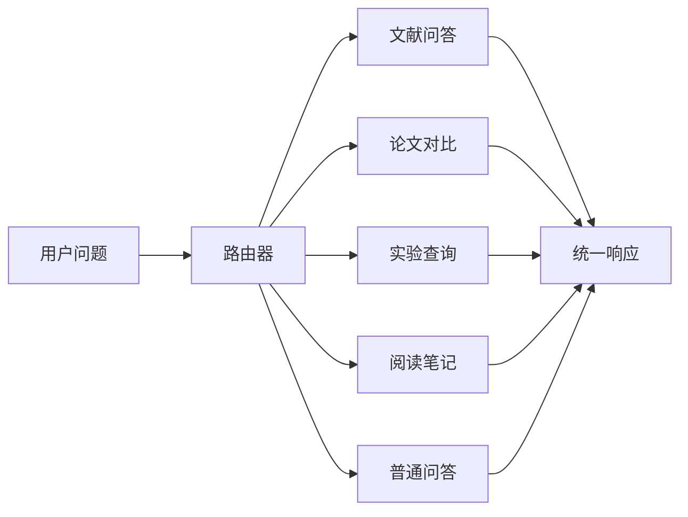

# 科研文献智能问答与实验分析助手设计说明

本文档描述项目的设计目标、模块划分、核心流程和扩展边界。系统面向本地科研资料管理场景，通过 RAG 和工作流编排提供可追溯的论文问答、实验记录查询和阅读笔记生成能力。

## 1. 设计目标

项目围绕三个目标展开：

1. **可追溯问答**：回答需要返回来源文件、页码、chunk id 和相关片段，方便核查依据。
2. **可解释检索**：检索结果保留 dense、BM25、hybrid、section/reranker 等关键分数，便于定位召回和排序问题。
3. **可复现交付**：提供本地启动、Docker、测试、CI、评测和敏感文件检查脚本，使项目能够在干净环境中复现主要流程。

系统默认用于单人本地知识库或小规模资料管理，不包含登录注册、多租户隔离、权限系统和生产级任务队列。

## 2. 功能范围

| 模块 | 功能 |
| --- | --- |
| 文档管理 | 上传 PDF/Markdown/TXT，创建、编辑、删除 Markdown/TXT，浏览源文档和 chunk |
| 知识库构建 | 文档加载、文本切分、元数据注入、Embedding、FAISS 索引持久化 |
| 检索增强 | Dense + BM25 混合召回、RRF 融合、section rerank、可选 reranker |
| RAG 问答 | 普通问答、SSE 流式问答、引用来源、相关 chunk 返回 |
| Agent 工作流 | 文献问答、论文对比、实验记录查询、阅读笔记生成、普通问答兜底 |
| 实验记录 | 基于 JSON 的实验记录检索和摘要 |
| 评测 | 评测集一致性检查、source hit、keyword hit、Recall@K、MRR、失败样例输出 |
| 前端控制台 | 文档管理、问答模式切换、检索调试、引用展示、评测入口 |

## 3. 技术选型

| 层次 | 选型 | 说明 |
| --- | --- | --- |
| Web/API | FastAPI, Pydantic, Uvicorn | 类型清晰，Swagger 自动生成，适合快速构建 API |
| RAG 框架 | LangChain | 文档加载、切分、向量检索和链路组织较成熟 |
| 工作流 | LangGraph | 适合将多意图任务拆成可解释节点 |
| 向量库 | FAISS | 本地运行成本低，适合小规模资料库 |
| 关键词检索 | BM25 | 弥补 dense 检索在术语、编号和关键词上的不足 |
| 模型接口 | OpenAI-compatible API | 便于切换 SiliconFlow 或其他兼容服务 |
| 前端 | 原生 HTML/CSS/JavaScript | 降低构建复杂度，方便直接跟后端同域运行 |
| 测试与质量 | Pytest, Ruff, GitHub Actions | 覆盖基础逻辑、接口 schema、评测数据和工程检查 |

## 4. 目录结构

```text
科研文献智能问答/
├─ app/
│  ├─ api/              # HTTP 路由
│  ├─ chains/           # RAG、对比、笔记、普通问答链
│  ├─ graph/            # LangGraph 状态、节点和工作流
│  ├─ models/           # Pydantic schema
│  ├─ retriever/        # 文档加载、切分、向量库、检索重排
│  ├─ services/         # 业务服务
│  ├─ static/           # Web 控制台
│  ├─ tools/            # Agent 工具
│  └─ utils/            # 日志、响应和文件工具
├─ data/
│  ├─ raw_docs/         # 源文档
│  ├─ processed_docs/   # chunk 中间产物，默认不提交
│  ├─ experiments/      # 实验记录
│  └─ eval/             # 评测集与本地评测结果
├─ docs/                # 项目文档
├─ scripts/             # 启动、建库、评测和审计脚本
├─ tests/               # 测试
└─ vector_store/        # FAISS 索引，默认不提交
```

## 5. 文档处理流程

```text
PDF / Markdown / TXT
  -> Loader 读取文本
  -> Splitter 切分 chunk
  -> 注入 source/page/doc_id/chunk_id/section
  -> Embedding
  -> FAISS index
  -> chunks.jsonl
```

### 5.1 Loader

- PDF 使用 `pypdf` 提取页级文本，并保留页码。
- Markdown/TXT 直接读取文本内容。
- 空文件、超大文件和不支持的格式会在上传阶段被拒绝。

### 5.2 Splitter

默认使用 `RecursiveCharacterTextSplitter`，结合中英文标点、段落和空格递归切分。默认参数：

```env
CHUNK_SIZE=800
CHUNK_OVERLAP=120
```

切分结果会保留 `source`、`page`、`doc_id`、`chunk_id`、`section` 等元数据，为检索调试、引用展示和评测提供依据。

### 5.3 Section 元数据

系统会根据标题、关键词和文本位置识别粗粒度 section：

```text
abstract / introduction / method / experiments / conclusion / limitations / references / body
```

这些信息用于回答“主要贡献”“方法流程”“实验结果”“局限性”等问题时的重排。

## 6. 检索与排序

检索层由 `app/retriever/retrieval.py` 组织，核心流程如下：

1. 根据问题推断检索意图。
2. 针对不同意图做查询扩展。
3. 使用 FAISS dense 检索获取语义候选。
4. 使用 BM25 从 `chunks.jsonl` 获取关键词候选。
5. 归一化分数并用 RRF 融合结果。
6. 根据 section 权重重排。
7. 如果启用 reranker，调用 SiliconFlow `/rerank` 做二阶段排序。

检索结果 metadata 中保留 `retrieval_channels`、`dense_score`、`bm25_score`、`hybrid_score`、`section_adjusted_score`、`rerank_score` 和 `ranker`，前端会展示这些字段。

## 7. RAG 生成

RAG 链路位于 `app/chains/rag_chain.py` 和 `app/services/rag_service.py`。

输入：

```json
{
  "question": "RAG 为什么要返回引用来源？",
  "top_k": 4
}
```

输出包含：

```json
{
  "answer": "...",
  "sources": [
    {
      "source": "rag_for_llm_applications.md",
      "page": null,
      "chunk_id": "..."
    }
  ],
  "related_chunks": []
}
```

生成阶段要求模型基于检索上下文回答。系统会统一补齐引用来源，避免完全依赖模型自行生成来源列表。

## 8. Agent 工作流

LangGraph 工作流位于 `app/graph/`，工具位于 `app/tools/`。



默认路由器使用规则匹配，保证测试稳定；配置 `AGENT_ROUTER_MODE=hybrid` 或 `llm` 后，可以启用模型路由作为兜底。响应中的 `tool_result` 会返回 `router`、`router_confidence` 和 `router_reason`，便于观察路由来源。

## 9. API 设计

核心接口：

| 接口 | 说明 |
| --- | --- |
| `GET /health` | 服务、API Key、索引和文档状态 |
| `POST /documents/upload` | 上传 PDF/Markdown/TXT |
| `GET /documents` | 查看源文档列表 |
| `POST /documents` | 新建 Markdown/TXT |
| `GET /documents/{filename}` | 读取源文档 |
| `PUT /documents/{filename}` | 更新 Markdown/TXT |
| `DELETE /documents/{filename}` | 删除源文档 |
| `GET /documents/chunks` | 查看 chunk |
| `POST /knowledge/build` | 构建知识库 |
| `POST /knowledge/search` | 检索 TopK |
| `POST /chat/rag` | 普通 RAG 问答 |
| `POST /chat/rag/stream` | SSE 流式 RAG 问答 |
| `POST /chat/agent` | Agent 工作流问答 |
| `POST /experiments/search` | 查询实验记录 |
| `POST /eval/run` | 运行评测 |

完整示例见 [API 接口文档](API接口文档.md)。

## 10. 索引一致性

文档变更后，后端 CRUD 接口会返回 `index_status=stale`。Web 控制台会在上传、创建、编辑、删除后调用 `/knowledge/build`，使前端使用路径中的索引保持同步。

直接调用 API 时，调用方可以选择：

1. 每次文档变更后立即调用 `/knowledge/build`。
2. 批量完成多次变更后再统一构建索引。

这种设计适合本地资料管理场景，也避免频繁上传文件时反复触发向量化。

## 11. 评测设计

评测集位于：

```text
data/eval/rag_eval_questions.csv
```

字段：

| 字段 | 含义 |
| --- | --- |
| `id` | 样例编号 |
| `question` | 用户问题 |
| `intent` | 预期意图 |
| `expected_source` | 预期来源 |
| `expected_keywords` | 预期关键词 |
| `expected_chunk_ids` | 可选 gold chunk |

指标：

- `source_hit_rate`
- `keyword_hit_rate`
- `retrieval_recall_at_k`
- `mean_reciprocal_rank`
- `avg_latency`
- `failed_cases`

评测说明见 [评测说明](评测说明.md)。

## 12. 前端控制台

前端位于 `app/static/`，主要区域包括：

- 运行区：上传文档、重建索引、运行评测、查看状态。
- 问答区：Agent、RAG、Search 三种模式；RAG 模式支持流式输出。
- 知识库区：源文档、chunk、引用来源和检索调试信息。

前端不引入构建工具，便于直接随 FastAPI 静态文件服务运行。

## 13. 安全与数据边界

- `.env`、真实 API Key、本地 `.venv/`、FAISS 索引、processed chunks 和评测输出不进入版本控制。
- 真实论文 PDF 可能涉及版权或再分发限制，默认只保留在本地。
- FAISS 索引加载涉及 pickle 元数据，`TRUST_LOCAL_FAISS_INDEX` 用于显式声明信任边界。
- 不加载陌生来源的 `index.pkl`。

## 14. 运行与验证

本地运行：

```powershell
python -m venv .venv
.\.venv\Scripts\Activate.ps1
pip install -r requirements.txt
Copy-Item .env.example .env
python scripts/build_index.py
uvicorn app.main:app --host 0.0.0.0 --port 8010 --reload
```

测试：

```powershell
python -m pytest
ruff check .
python scripts/open_source_audit.py
```

Docker：

```powershell
docker compose up --build
```

## 15. 实现边界

- 默认适配文本型 PDF，不包含 OCR。
- 默认路由器是规则路由，模型路由为可选能力。
- 评测指标用于回归和定位问题，不替代人工质量评审。
- 系统没有多用户隔离和权限模型。
- 引用来源来自检索结果，未做逐句 citation grounding。

更细的实现边界见 [实现边界说明](实现边界说明.md)。
