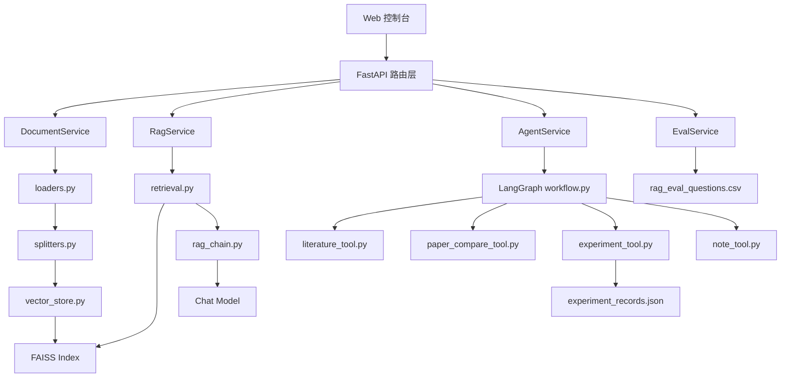
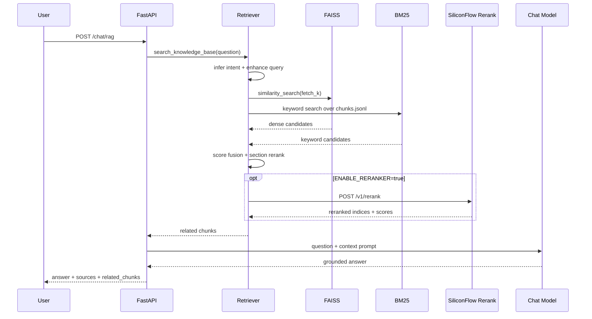

# 项目架构

本文档用于说明“科研文献智能问答与实验分析助手”的模块边界、核心数据流和关键设计取舍。

## 1. 总体架构

## 2. 后端分层

| 层次 | 目录 | 职责 |
| --- | --- | --- |
| API 层 | `app/api/` | 处理 HTTP 请求、参数校验和响应 schema |
| Service 层 | `app/services/` | 封装业务流程，避免路由直接操作底层模块 |
| Retriever 层 | `app/retriever/` | 文档加载、切分、索引构建、检索和重排 |
| Chain 层 | `app/chains/` | LLM Prompt 和具体生成逻辑 |
| Agent 层 | `app/graph/`, `app/tools/` | LangGraph 工作流和工具调用 |
| Model 层 | `app/models/` | Pydantic 请求、响应、来源和评测结构 |

## 3. RAG 数据流

## 4. Agent 路由

Agent 使用 LangGraph 编排，核心目标是把不同类型的问题交给不同工具：

| intent | 典型问题 | 处理方式 |
| --- | --- | --- |
| `literature_qa` | “这篇论文的主要贡献是什么？” | 检索文献 chunk 并生成回答 |
| `paper_compare` | “对比 LoRA 和知识蒸馏” | 检索多个主题并做结构化对比 |
| `experiment_query` | “查询 EXP-003 的结果” | 检索实验 JSON 记录 |
| `reading_note` | “生成阅读笔记” | 基于文献片段生成笔记 |
| `general_chat` | “解释一下 RAG 是什么” | 走普通兜底问答 |

## 5. 检索增强策略

初始版本只做向量相似度 TopK，容易在真实论文中检索到参考文献或局部技术细节。当前版本增加了四层优化：

1. 问题意图识别：识别 contribution、method、experiment、limitation、summary 等检索意图。
2. 查询增强：为不同意图追加英文提示词，例如 contribution 会追加 abstract、introduction、main contribution 等词。
3. hybrid retrieval：FAISS dense 召回语义候选，BM25 从 `chunks.jsonl` 召回关键词候选，再按归一化分数和 RRF 融合。
4. section/reranker 精排：先根据 chunk 的 `section` 元数据做重排，例如“主要贡献”优先 Abstract/Introduction，“实验结果”优先 Experiments/Results；开启 `ENABLE_RERANKER=true` 后，继续调用 SiliconFlow `/rerank` 做二阶段精排。

默认配置不依赖额外 rerank 模型，适合本地测试和 CI；演示或真实使用时可以打开 SiliconFlow reranker，提高 TopK 片段排序质量。

## 6. 为什么返回引用来源

科研问答最怕“答得像真的，但无法核查”。因此接口统一返回：

- `sources`：回答使用过的文件、页码、chunk id。
- `related_chunks`：检索到的原始片段。
- `score`：向量检索距离或相似度相关分数。

这样既能帮助用户检查依据，也能帮助开发者定位失败原因。

## 7. 当前边界

- 当前没有用户登录和多租户隔离。
- 当前 PDF 解析以文本型 PDF 为主，扫描版 PDF 需要后续接 OCR。
- 当前 Markdown/TXT 可编辑，PDF 只读。
- 当前评测是轻量启发式指标，不等同于严格人工评测。
