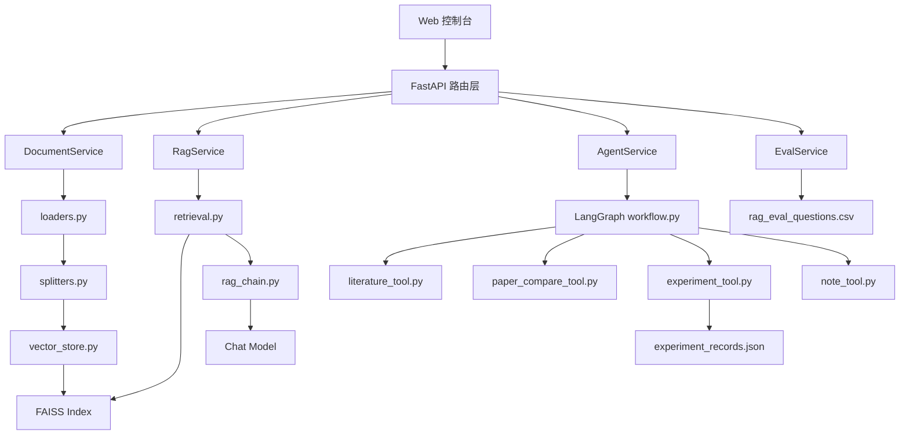
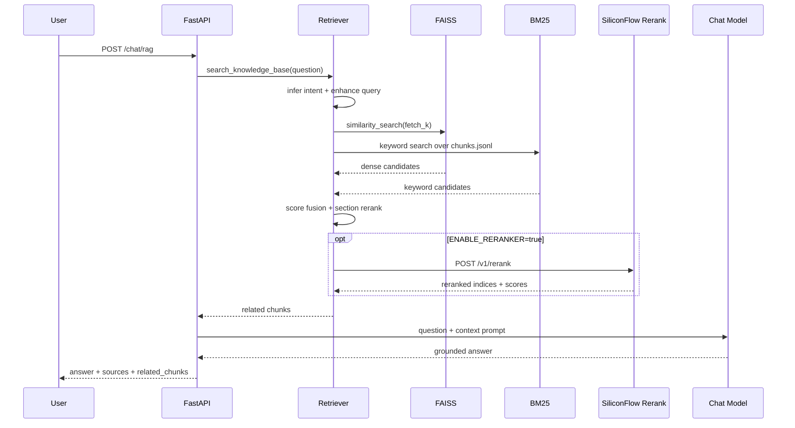

# 项目架构

本文介绍“科研文献智能问答与实验分析助手”的模块边界、核心数据流和关键设计取舍。系统采用本地优先的 RAG 架构，重点解决科研资料检索、证据引用和多意图任务编排问题。

## 1. 总体架构

## 2. 后端分层

| 层次 | 目录 | 职责 |
| --- | --- | --- |
| API 层 | `app/api/` | 处理 HTTP 请求、参数校验和响应 schema |
| Service 层 | `app/services/` | 封装业务流程，保持路由层轻量 |
| Retriever 层 | `app/retriever/` | 文档加载、切分、索引构建、检索和重排 |
| Chain 层 | `app/chains/` | LLM Prompt、上下文组装和生成逻辑 |
| Agent 层 | `app/graph/`, `app/tools/` | LangGraph 工作流和工具调用 |
| Model 层 | `app/models/` | Pydantic 请求、响应、来源和评测结构 |

## 3. RAG 数据流

## 4. Agent 工作流

Agent 层使用 LangGraph 编排多意图流程。路由器先识别问题类型，再进入对应工具节点，最后统一生成结构化响应。

| intent | 典型问题 | 处理方式 |
| --- | --- | --- |
| `literature_qa` | “这篇论文的主要贡献是什么？” | 检索文献 chunk 并生成回答 |
| `paper_compare` | “对比 LoRA 和知识蒸馏” | 检索多个主题并做结构化对比 |
| `experiment_query` | “查询 EXP-003 的结果” | 检索实验 JSON 记录 |
| `reading_note` | “生成阅读笔记” | 基于文献片段生成笔记 |
| `general_chat` | “解释一下 RAG 是什么” | 走普通兜底问答 |

默认路由器使用规则匹配，便于本地调试和测试复现。设置 `AGENT_ROUTER_MODE=hybrid` 或 `llm` 后，可以启用模型路由作为兜底。

## 5. 检索增强策略

单纯向量相似度 TopK 容易在真实论文中命中参考文献页或局部技术细节。系统在基础 dense 检索之上增加四层处理：

1. 问题意图识别：识别 contribution、method、experiment、limitation、summary 等检索意图。
2. 查询增强：为不同意图追加英文提示词，例如 contribution 会追加 abstract、introduction、main contribution 等词。
3. Hybrid retrieval：FAISS dense 召回语义候选，BM25 从 `chunks.jsonl` 召回关键词候选，再按归一化分数和 RRF 融合。
4. Section/reranker 精排：先根据 chunk 的 `section` 元数据做重排；开启 `ENABLE_RERANKER=true` 后，继续调用 SiliconFlow `/rerank` 做二阶段精排。

默认配置不依赖额外 rerank 模型，适合本地测试和 CI；需要更高排序质量时可以开启 reranker。

## 6. 引用来源设计

科研问答需要让答案可核查，因此接口统一返回：

- `sources`：回答使用过的文件、页码、chunk id。
- `related_chunks`：检索到的原始片段。
- `score`：向量检索距离或相似度相关分数。

前端会把答案、引用来源和相关 chunk 放在同一页面中展示，便于核对模型回答是否被检索证据支持。

## 7. 实现边界

- 系统没有用户登录和多租户隔离，适合单人本地知识库或小规模验证环境。
- PDF 解析以文本型 PDF 为主，扫描版 PDF 需要额外 OCR 流程。
- Markdown/TXT 可编辑，PDF 只读。
- 后端 CRUD 接口会返回 `index_status=stale`，调用方需要显式触发 `/knowledge/build`；Web 控制台会在文档变更后调用重建接口。
- 评测指标属于轻量启发式指标，适合持续回归和快速定位问题，不等同于严格人工评测。
